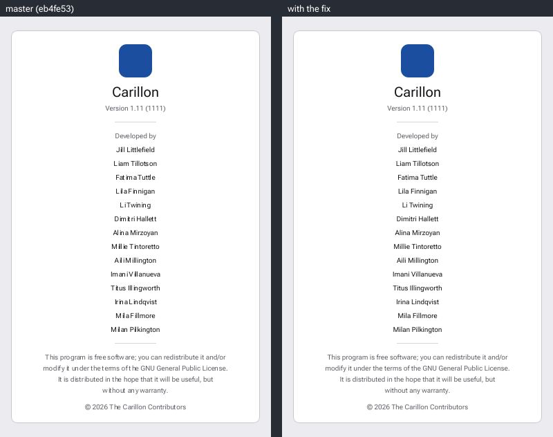
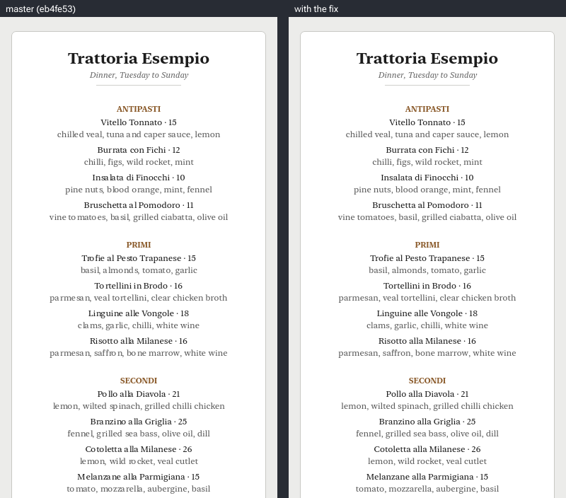
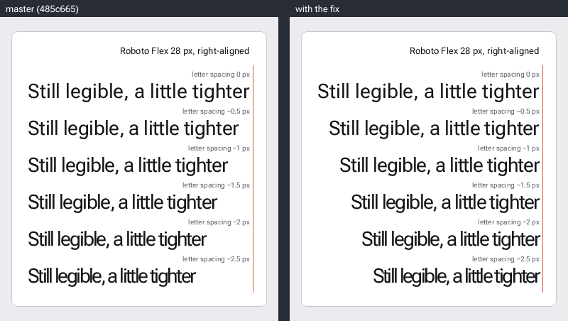

# femtovg: comparison images for two text bugs

The programs that made the comparison images for two pull requests to
[femtovg](https://github.com/femtovg/femtovg). In each of the three images below, the left half
is a scene built against upstream master and the right half is the same scene built against the
commit of its pull request. Both halves are drawn at device pixel ratio 1 and nothing is
rescaled.

The first pull request, [femtovg/femtovg#384](https://github.com/femtovg/femtovg/pull/384),
fixes the glyph-mask bug: with the `swash` feature, filled text at a negative x is drawn with
the wrong glyph mask. Left: upstream master at
[`eb4fe53`](https://github.com/femtovg/femtovg/commit/eb4fe53d51a6a274754a787a55179140bc7d6c77).
The typeface, the font size and the content of its two scenes were chosen by a search to make
the effect as large as possible (see below).

An About panel, Roboto Flex 10 px:



A menu card, New York 12 px (the top 680 px of a 912 px render):



The second pull request fixes the letter-spacing bug: text at a negative letter spacing gets the
width that the same text, in the same font and font size, had at the letter spacing it was first
shaped with, when that was 0 or negative. The gaps between its glyphs are right; only the width
is wrong. Left: upstream master at
[`485c665`](https://github.com/femtovg/femtovg/commit/485c66566bac9b4a580d2afb8d8230122d6f8457).
The alignment, the sentence, the letter spacings and the order of the lines were chosen by hand
to make the effect large (see below).

A letter-spacing specimen, Roboto Flex 28 px. Every line is drawn with `Align::Right` at the
same x, which is 4 px left of the red rule:



`images/` also has each whole render, and a 4x enlargement of part of the About panel and of
the menu card.

## The glyph-mask bug

With the `swash` cargo feature, femtovg rasterizes a filled glyph into a coverage bitmap (a
mask), keeps it in the glyph atlas and reuses it. It keeps one mask per tenth of a pixel of the
fraction of the glyph's x. `GlyphAtlas::render_atlas` in `src/text.rs` computes that tenth as
`quantize(glyph.x.fract(), 0.1) * 10.0` and casts it to `u8` for the cache key. For a negative
x the value is zero or negative, and the cast gives 0. So every negative x of a glyph shares
one cache entry with the glyph's whole-pixel positions, and the glyph is drawn with whichever
mask was rasterized first, up to 1 px from its place. Neighbouring glyphs get different errors,
so the gap between two letters can be wrong by almost 2 px.

`glyph.x` does not include the canvas translation. The About panel and the menu card draw every
line like this, which gives the left half of the line a negative x:

```rust
canvas.save();
canvas.translate(cx, baseline);
canvas.fill_text(0.0, 0.0, text, &paint)?; // paint has Align::Center
canvas.restore();
```

### What was chosen to make the effect large

[`search/about_names.py`](search/about_names.py) chose the 14 names and their order.
[`search/menu_climb.py`](search/menu_climb.py) chose which dishes each course lists, their
order, each price within 2 of a base price, and the order of the ingredients. Of the typefaces
and sizes tried, the one with the most wrong gaps was kept for each scene.

The search does not make any single error larger. It raises the number of neighbouring glyphs
that get different errors:

| gaps between neighbouring glyphs wrong by 1 px or more | searched | 1000 random choices: mean (range) |
| ------------------------------------------------------ | -------- | --------------------------------- |
| About panel (398 gaps)                                 | 78       | 17.6 (6 to 36)                    |
| Menu card (897 gaps)                                   | 119      | 32.9 (10 to 70)                   |

[`src/replay.rs`](src/replay.rs) computes these counts from the glyph positions that
`fill_text` returned. They are not measured from pixels. The random choices were counted, not
rendered.

## The letter-spacing bug

This bug does not need the `swash` feature. It is in the `textlayout` feature, which is on by
default, and the specimen is built without `swash`.

femtovg caches shaped text. `shape` in `src/text/textlayout.rs` keeps the `TextMetrics` of a
whole string in `shaping_run_cache`, and `shape_run` keeps every word of it in
`shaped_words_cache`. The key of both caches is a `ShapingId`. `ShapingId::new` computes its
field `letter_spacing_key` as `(letter_spacing * 10.0).trunc() as u32`, and the cast gives 0 for
a negative value. So every negative letter spacing has the key 0, which is also the key of
letter spacing 0, and the same text in the same font and font size shares one cache entry at
all of them.

A cache entry holds the advance of each glyph without the letter spacing, and a width that
includes it: `shape_word` adds `advance_x + letter_spacing` to `ShapedWord::width` for every
glyph. `layout` computes the glyph positions on every call, from the advances and the letter
spacing of that call. So text that is found in the cache gets the right gaps between its glyphs,
and the width that it had at the letter spacing it was first shaped with. That width is what
`TextMetrics::width()` returns, and what `layout` subtracts from x for `Align::Right`. For
`Align::Center` it subtracts half.

The specimen draws one sentence six times, at letter spacing 0 first and then at -0.5, -1, -1.5,
-2 and -2.5 px:

```rust
let paint = sample.clone().with_letter_spacing(letter_spacing); // sample has Align::Right
canvas.fill_text(RIGHT, baseline, SAMPLE, &paint)?;
```

On master the five lines with a negative letter spacing get the cache entry of the first line.
All six start at the same x, and a line with a more negative letter spacing ends further left
of `RIGHT`. With the fix every line ends at `RIGHT`.

Here a line ends where `layout` leaves its cursor after the last glyph. `layout` moves the
cursor by the advance of a glyph plus the letter spacing, so with a negative letter spacing the
advance of the last glyph ends right of the end of the line by the size of the letter spacing,
up to 2.5 px. That is why the red rule is 4 px right of `RIGHT` and not at `RIGHT`.

### What was chosen to make the width error large

Nothing was searched for. The error of a line is the number of its glyphs times the difference
between its letter spacing and the letter spacing that the cached width was computed with. These
were chosen by hand:

- `Align::Right`, because `layout` then subtracts the whole width from x, so the line is drawn
  left of its place by the whole error of the width. With `Align::Center` it would be half.
- The same sentence on every line, with the line at letter spacing 0 first. Every later line
  finds the `TextMetrics` of the first line in `shaping_run_cache`, so its width is the width at
  letter spacing 0, which is too large by the letter spacing of all 31 glyphs, spaces included.
- A sentence of 31 glyphs, "Still legible, a little tighter". It has many narrow letters (i, l
  and t), so the 31 glyphs are 312.32 px wide at letter spacing 0 and fit on one line of the
  card.
- Letter spacings down to -2.5 px at a font size of 28 px. In the tightest lines neighbouring
  letters touch, which is tighter than text is normally set.

| letter spacing | glyphs | `TextMetrics::width()` on master | with the fix | on master the line ends left of `RIGHT` by |
| -------------- | ------ | -------------------------------- | ------------ | ------------------------------------------ |
| 0 px           | 31     | 312.32 px                        | 312.32 px    | 0 px                                       |
| -0.5 px        | 31     | 312.32 px                        | 296.82 px    | 15.5 px                                    |
| -1 px          | 31     | 312.32 px                        | 281.32 px    | 31 px                                      |
| -1.5 px        | 31     | 312.32 px                        | 265.82 px    | 46.5 px                                    |
| -2 px          | 31     | 312.32 px                        | 250.32 px    | 62 px                                      |
| -2.5 px        | 31     | 312.32 px                        | 234.82 px    | 77.5 px                                    |

On master the last column adds up to 232.5 px and its largest value is 77.5 px. With the fix
every value in it is 0 px. [`src/spacing.rs`](src/spacing.rs) computes these numbers from the
`TextMetrics` that `fill_text` returned, on both revisions. They are not measured from pixels.
[`images/spacing-summary.txt`](images/spacing-summary.txt) has all of them.

## Running it

```sh
./run.sh
```

This needs git, cargo, a GPU that wgpu can use, and network access. The script checks out two
femtovg revisions for each pull request, builds the scenes against them, draws and composes the
images into `out/`, and reports how many pixels differ from the files in `images/`. The
committed images were made on macOS 26 with wgpu on Metal. Another GPU or driver may give a few
different pixels.

| variable              | default                                    | meaning                                                             |
| --------------------- | ------------------------------------------ | ------------------------------------------------------------------- |
| `FEMTOVG_URL`         | `https://github.com/femtovg/femtovg`       | where the revision with the glyph-mask bug is                       |
| `MASTER_REV`          | `eb4fe53d51a6a274754a787a55179140bc7d6c77` | upstream master when the About panel and the menu card were written |
| `FIXED_URL`           | `https://github.com/jfarmer/femtovg`       | where the revision with the fix of that bug is                      |
| `FIXED_REV`           | `97171befe2f7a7afe9e60259ed59a29dd633a5fa` | the commit of the first pull request                                |
| `SPACING_FEMTOVG_URL` | `https://github.com/femtovg/femtovg`       | where the revision with the letter-spacing bug is                   |
| `SPACING_MASTER_REV`  | `485c66566bac9b4a580d2afb8d8230122d6f8457` | upstream master when the specimen was written                       |
| `SPACING_FIXED_URL`   | `https://github.com/jfarmer/femtovg`       | where the revision with the fix of that bug is                      |
| `SPACING_FIXED_REV`   | `d6cb70df1deb1c1182f125ff49c59ed9c0344801` | the commit of the second pull request                               |

The first four are for the About panel and the menu card, the last four for the specimen. A
URL may be the path of a local clone. A revision is a full commit hash, or the name of a
branch or tag. If a pull request has changed since this was written, run
`FIXED_REV=glyph-mask-phase-keys ./run.sh` or
`SPACING_FIXED_REV=letter-spacing-cache-key ./run.sh`.

No font file is in this repository. Roboto Flex is read from femtovg's `examples/assets`.
New York is an Apple system font, read from `/System/Library/Fonts` or from `NEW_YORK_DIR`.
Where it is missing, the menu card is not drawn.
