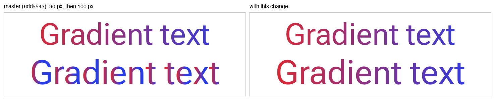
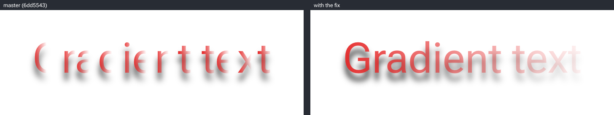
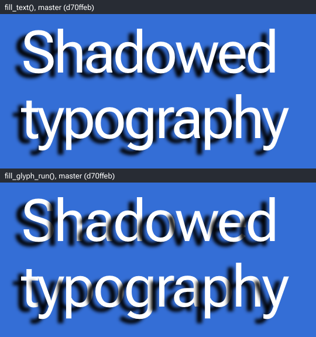
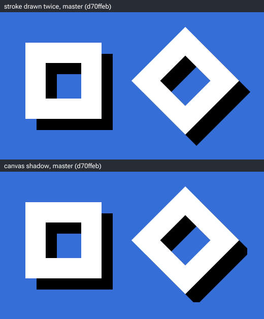
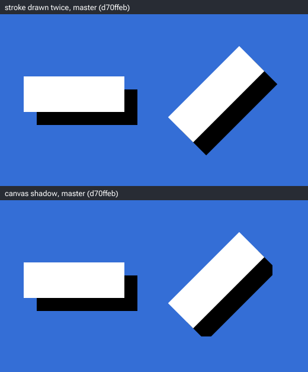
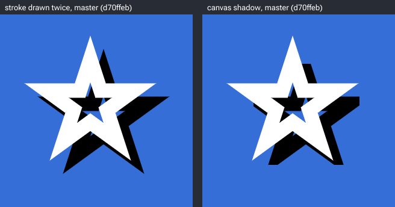
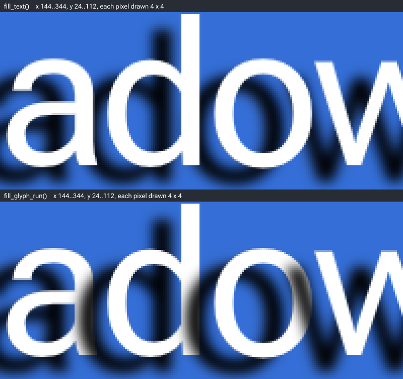

# femtovg: comparison images for five bugs

The [portable profiling harness](profiling/README.md) compares CPU work for the
direct-text gradient fix (#389), with draw/flush timing, allocation accounting,
macOS Instruments capture, and a Linux `perf` collector.

The programs that made the comparison images for three pull requests to
[femtovg](https://github.com/femtovg/femtovg), and for two more bugs that have no pull request
yet. In each of the first five images below, the left half is a scene built against upstream
master and the right half is the same scene built against the commit of its pull request. Both
halves are drawn at device pixel ratio 1 and nothing is rescaled.

The first pull request, [femtovg/femtovg#384](https://github.com/femtovg/femtovg/pull/384),
fixes the glyph-mask bug: with the `swash` feature, filled text at a negative x is drawn with
the wrong glyph mask. Left: upstream master at
[`eb4fe53`](https://github.com/femtovg/femtovg/commit/eb4fe53d51a6a274754a787a55179140bc7d6c77).
The typeface, the font size and the content of its two scenes were chosen by a search to make
the effect as large as possible (see below).

An About panel, Roboto Flex 10 px:


A menu card, New York 12 px (the top 680 px of a 912 px render):


The second pull request fixes the letter-spacing bug: text at a negative letter spacing gets the
width that the same text, in the same font and font size, had at the letter spacing it was first
shaped with, when that was 0 or negative. The gaps between its glyphs are right; only the width
is wrong. Left: upstream master at
[`485c665`](https://github.com/femtovg/femtovg/commit/485c66566bac9b4a580d2afb8d8230122d6f8457).
The alignment, the sentence, the letter spacings and the order of the lines were chosen by hand
to make the effect large (see below).

A letter-spacing specimen, Roboto Flex 28 px. Every line is drawn with `Align::Right` at the
same x, which is 4 px left of the red rule:


The third pull request fixes the gradient bug. When femtovg draws the glyphs of a text as
outlines, a gradient or image paint is applied to each glyph separately, so a gradient starts
again in every letter. The left half is upstream master at
[`6dd5543`](https://github.com/femtovg/femtovg/commit/6dd55434177690c845fc5e6f8e9d5a2fe6f1b277).
The font sizes and the gradients were chosen by hand (see below).

Two lines with one gradient across the canvas, Roboto Flex. The top line is 90 px and comes from
the glyph atlas. The bottom line is 100 px and is drawn as outlines.



One 100 px line with a gradient that goes from opaque to transparent, under a blurred shadow.



The fourth bug is the glyph-run shadow bug. With a canvas shadow set, `fill_text` casts one
shadow for the whole text, and `fill_glyph_run` casts one for every glyph that it draws as an
outline. The shadow of a glyph is drawn after the glyphs before it, and covers them where it
reaches them. Both halves of the image are upstream master at
[`d70ffeb`](https://github.com/femtovg/femtovg/commit/d70ffeb79658606fe220801115ccefff33897e86).
The upper half is drawn with `fill_text` and the lower half with `fill_glyph_run`. The words, the
letter spacing, the colours and the shadow were chosen by hand (see below).

Two 100 px lines, Roboto Flex, under a shadow that is 14 px left of the text and 8 px below it:



The fifth bug is the shadow cut-off bug. The shadow of a stroke is cut off where a miter join
or a square cap reaches more than half the line width past the bounding box of the path's
points. Every render is upstream master at
[`d70ffeb`](https://github.com/femtovg/femtovg/commit/d70ffeb79658606fe220801115ccefff33897e86).
One render of each scene sets no canvas shadow and draws the stroke twice, the first time in
black where the shadow belongs. The other draws the stroke once under a canvas shadow that has
no blur. The two should be the same. The shapes, the line widths and the shadow were chosen by
hand (see below).

The outline of a square with miter joins, upright and turned by 45 degrees:



A line with square caps, level and turned by 45 degrees:



The outline of a five-pointed star with miter joins:



`images/` also has each whole render, and a 4x enlargement of part of the About panel, of the
menu card and of the shadow scene.

## The glyph-mask bug

With the `swash` cargo feature, femtovg rasterizes a filled glyph into a coverage bitmap (a
mask), keeps it in the glyph atlas and reuses it. It keeps one mask per tenth of a pixel of the
fraction of the glyph's x. `GlyphAtlas::render_atlas` in `src/text.rs` computes that tenth as
`quantize(glyph.x.fract(), 0.1) * 10.0` and casts it to `u8` for the cache key. For a negative
x the value is zero or negative, and the cast gives 0. So every negative x of a glyph shares
one cache entry with the glyph's whole-pixel positions, and the glyph is drawn with whichever
mask was rasterized first, up to 1 px from its place. Neighbouring glyphs get different errors,
so the gap between two letters can be wrong by almost 2 px.

`glyph.x` does not include the canvas translation. The About panel and the menu card draw every
line like this, which gives the left half of the line a negative x:

```rust
canvas.save();
canvas.translate(cx, baseline);
canvas.fill_text(0.0, 0.0, text, &paint)?; // paint has Align::Center
canvas.restore();
```

### What was chosen to make the effect large

[`search/about_names.py`](search/about_names.py) chose the 14 names and their order.
[`search/menu_climb.py`](search/menu_climb.py) chose which dishes each course lists, their
order, each price within 2 of a base price, and the order of the ingredients. Of the typefaces
and sizes tried, the one with the most wrong gaps was kept for each scene.

The search does not make any single error larger. It raises the number of neighbouring glyphs
that get different errors:

| gaps between neighbouring glyphs wrong by 1 px or more | searched | 1000 random choices: mean (range) |
| ------------------------------------------------------ | -------- | --------------------------------- |
| About panel (398 gaps)                                 | 78       | 17.6 (6 to 36)                    |
| Menu card (897 gaps)                                   | 119      | 32.9 (10 to 70)                   |

[`src/replay.rs`](src/replay.rs) computes these counts from the glyph positions that
`fill_text` returned. They are not measured from pixels. The random choices were counted, not
rendered.

## The letter-spacing bug

This bug does not need the `swash` feature. It is in the `textlayout` feature, which is on by
default, and the specimen is built without `swash`.

femtovg caches shaped text. `shape` in `src/text/textlayout.rs` keeps the `TextMetrics` of a
whole string in `shaping_run_cache`, and `shape_run` keeps every word of it in
`shaped_words_cache`. The key of both caches is a `ShapingId`. `ShapingId::new` computes its
field `letter_spacing_key` as `(letter_spacing * 10.0).trunc() as u32`, and the cast gives 0 for
a negative value. So every negative letter spacing has the key 0, which is also the key of
letter spacing 0, and the same text in the same font and font size shares one cache entry at
all of them.

A cache entry holds the advance of each glyph without the letter spacing, and a width that
includes it: `shape_word` adds `advance_x + letter_spacing` to `ShapedWord::width` for every
glyph. `layout` computes the glyph positions on every call, from the advances and the letter
spacing of that call. So text that is found in the cache gets the right gaps between its glyphs,
and the width that it had at the letter spacing it was first shaped with. That width is what
`TextMetrics::width()` returns, and what `layout` subtracts from x for `Align::Right`. For
`Align::Center` it subtracts half.

The specimen draws one sentence six times, at letter spacing 0 first and then at -0.5, -1, -1.5,
-2 and -2.5 px:

```rust
let paint = sample.clone().with_letter_spacing(letter_spacing); // sample has Align::Right
canvas.fill_text(RIGHT, baseline, SAMPLE, &paint)?;
```

On master the five lines with a negative letter spacing get the cache entry of the first line.
All six start at the same x, and a line with a more negative letter spacing ends further left
of `RIGHT`. With the fix every line ends at `RIGHT`.

Here a line ends where `layout` leaves its cursor after the last glyph. `layout` moves the
cursor by the advance of a glyph plus the letter spacing, so with a negative letter spacing the
advance of the last glyph ends right of the end of the line by the size of the letter spacing,
up to 2.5 px. That is why the red rule is 4 px right of `RIGHT` and not at `RIGHT`.

### What was chosen to make the width error large

Nothing was searched for. The error of a line is the number of its glyphs times the difference
between its letter spacing and the letter spacing that the cached width was computed with. These
were chosen by hand:

- `Align::Right`, because `layout` then subtracts the whole width from x, so the line is drawn
  left of its place by the whole error of the width. With `Align::Center` it would be half.
- The same sentence on every line, with the line at letter spacing 0 first. Every later line
  finds the `TextMetrics` of the first line in `shaping_run_cache`, so its width is the width at
  letter spacing 0, which is too large by the letter spacing of all 31 glyphs, spaces included.
- A sentence of 31 glyphs, "Still legible, a little tighter". It has many narrow letters (i, l
  and t), so the 31 glyphs are 312.32 px wide at letter spacing 0 and fit on one line of the
  card.
- Letter spacings down to -2.5 px at a font size of 28 px. In the tightest lines neighbouring
  letters touch, which is tighter than text is normally set.

| letter spacing | glyphs | `TextMetrics::width()` on master | with the fix | on master the line ends left of `RIGHT` by |
| -------------- | ------ | -------------------------------- | ------------ | ------------------------------------------ |
| 0 px           | 31     | 312.32 px                        | 312.32 px    | 0 px                                       |
| -0.5 px        | 31     | 312.32 px                        | 296.82 px    | 15.5 px                                    |
| -1 px          | 31     | 312.32 px                        | 281.32 px    | 31 px                                      |
| -1.5 px        | 31     | 312.32 px                        | 265.82 px    | 46.5 px                                    |
| -2 px          | 31     | 312.32 px                        | 250.32 px    | 62 px                                      |
| -2.5 px        | 31     | 312.32 px                        | 234.82 px    | 77.5 px                                    |

On master the last column adds up to 232.5 px and its largest value is 77.5 px. With the fix
every value in it is 0 px. [`src/spacing.rs`](src/spacing.rs) computes these numbers from the
`TextMetrics` that `fill_text` returned, on both revisions. They are not measured from pixels.
[`images/spacing-summary.txt`](images/spacing-summary.txt) has all of them.

## The gradient bug

This bug does not need the `swash` feature either, and the two scenes are built without it.

femtovg draws a glyph from the glyph atlas or as an outline. `draw_glyph_run` in `src/lib.rs`
chooses the outline for text larger than 92 px, and for text with a gradient or image paint
under a scale, rotation, skew or flip. `render_direct` in `src/text.rs` then fills or strokes
the outline of each glyph as a path.

On master `render_direct` places each glyph by changing the canvas transform. For every glyph it
calls `save()`, `translate()` and `scale()`, draws the outline, and calls `restore()`. The
canvas transform also maps the coordinates of the paint. So the paint is mapped again for every
glyph, in that glyph's font units and from that glyph's origin, and each letter gets its own
small copy of the gradient. With the fix `render_direct` does not change the canvas transform.
It passes the glyph's placement along with the outline, and the paint is mapped by the canvas
transform as for any other shape.

The first scene draws the same words twice with one paint.

```rust
let paint = Paint::linear_gradient(40.0, 0.0, 680.0, 0.0, red, blue); // and the font and alignment
canvas.fill_text(360.0, 65.0, "Gradient text", &paint.clone().with_font_size(90.0))?;
canvas.fill_text(360.0, 180.0, "Gradient text", &paint.with_font_size(100.0))?;
```

The 90 px line comes from the glyph atlas and is the same on both revisions. The 100 px line is
drawn as outlines. On master every letter of it has its own gradient. With the fix the gradient
runs across the line, as it does in the line above.

The second scene shows the same fault in a shadow. femtovg builds a shadow by drawing the text a
second time into an offscreen image and giving the result the shadow colour, so a shadow has
the alpha of what was drawn. It is wrong only when the alpha of the paint varies. In this scene
the gradient goes from opaque red to transparent red.

```rust
let paint = Paint::linear_gradient(40.0, 0.0, 680.0, 0.0, red, transparent_red); // and the font, 100 px
canvas.set_shadow_color(Color::black());
canvas.set_shadow_offset(0.0, 18.0);
canvas.set_shadow_blur(14.0);
canvas.fill_text(360.0, 115.0, "Gradient text", &paint)?;
```

On master the text fades inside every letter, and every letter has its own patch of shadow. With
the fix the text and its shadow both fade once, from the left end of the line to the right end.

### What was chosen to make the effect easy to see

Nothing was searched for. These were chosen by hand:

- Font sizes of 90 px and 100 px, one on each side of the 92 px limit. One picture then shows
  text from the glyph atlas and text drawn as outlines with the same paint.
- A gradient that spans the canvas, so that the 90 px line shows what the 100 px line should
  look like.
- A gradient to transparent in the shadow scene, because a shadow takes only its alpha from the
  paint.
- A shadow that is 18 px below the text and blurred by 14 px. It stays visible under the
  letters and looks like a shadow.

[`src/gradient.rs`](src/gradient.rs) draws both scenes. It prints nothing, so
[`images/gradient-text-summary.txt`](images/gradient-text-summary.txt) and
[`images/gradient-shadow-summary.txt`](images/gradient-shadow-summary.txt) have only the number
of pixels in which the two revisions differ.

## The glyph-run shadow bug

This bug does not need the `swash` feature either, and the scene is built without it.

Three functions in femtovg's `src/lib.rs` cast a canvas shadow: `fill_path_internal`,
`stroke_path_internal` and `draw_text`. `fill_text` and `stroke_text` call `draw_text`, which
casts one shadow for the whole text and turns the shadow off while it draws the glyphs.
`fill_glyph_run` and `stroke_glyph_run` call `draw_glyph_run` directly, and `draw_glyph_run` has
no shadow code. It draws text larger than 92 px as outlines: `render_direct` in `src/text.rs`
fills or strokes the outline of each glyph with `fill_path_internal` or `stroke_path_internal`,
and each of those calls casts a shadow. So a glyph run is drawn as shadow, glyph, shadow, glyph,
and the shadow of a glyph lies over the glyphs that were drawn before it.

A glyph run that is drawn from the glyph atlas casts no shadow at all. This scene does not show
that.

The scene draws each of its two lines with one call. The upper half of the image uses
`fill_text`. The lower half asks `measure_text` for the glyphs of the line and passes them to
`fill_glyph_run`, so both halves draw every glyph at the same place.

```rust
canvas.set_shadow_color(Color::black());
canvas.set_shadow_offset(-14.0, 8.0);
canvas.set_shadow_blur(6.0);

// The upper half.
canvas.fill_text(36.0, baseline, line, &paint)?;

// The lower half. `glyphs` has the glyph ids and positions that measure_text returned.
canvas.fill_glyph_run(font, &[], glyphs, &paint)?;
```

Without the shadow the two halves are the same in every pixel. With it, `fill_text` leaves every
letter white, and `fill_glyph_run` darkens the right side of a letter with the shadow of the
next one. The a, the d and the o of the first line, enlarged 4 times:



### What was chosen to make the effect easy to see

Nothing was searched for. These were chosen by hand:

- A shadow to the left of the text. A line is drawn from left to right, so a shadow to the left
  lands on letters that are already drawn. A shadow to the right lands where the next letter is
  drawn afterwards, and that letter covers it.
- A font size of 100 px, above the 92 px limit, so that every glyph is drawn as an outline.
- A letter spacing of -4 px. The closer two letters are, the more of the left one the shadow of
  the right one covers. This is tighter than the font's own spacing, and some letters almost
  touch.
- Words with many round letters (a, d, e, g, o and p). A round side comes closer to the next
  letter than a straight stem does.
- White text on blue under a black shadow, so that the shadow shows on the background and on a
  letter.
- Two lines, to show more pairs of letters. Each line is drawn with its own call in both halves,
  and the shadow of the first line does not reach the second.

[`src/shadow.rs`](src/shadow.rs) draws the scene.
[`images/shadow-summary.txt`](images/shadow-summary.txt) has the number of pixels in which
`fill_text` and `fill_glyph_run` differ, without the shadow and with it.

## The shadow cut-off bug

This bug is not specific to text, and the scenes draw none.

femtovg makes a shadow by drawing the shape a second time into an offscreen image, and it sets
the size of that image before it draws. For a stroke, `stroke_path_internal` in `src/lib.rs`
takes the bounding box of the path's points and grows it by half the line width on each side.
A stroke can reach further than that in two places. A miter join reaches half the line width
divided by the sine of half the angle between its two edges, measured from the corner. A corner
of a square cap is 1.41 times half the line width from the end of the line. The part of the
stroke that is outside the image has no shadow.

At a right angle a miter reaches 1.41 times half the line width from the corner, the same as
the corner of a square cap. For a corner on the edge of the bounding box, whether that is
outside the image depends on its direction. With one edge along x and the other along y, it is
half the line width along x and half along y, so it is inside and the shadow is whole. Turned
by 45 degrees, it is 1.41 times half the line width along one of the two, so the tip is
outside. A miter sharper than a right angle reaches further still.

The first two scenes show this with one shape drawn twice: upright on the left, where the
shadow is whole, and turned by 45 degrees on the right, where its corners are cut off. The Web
Platform Tests for Canvas shadows have the upright shapes only:
[`2d.shadow.stroke.join.2`](https://github.com/web-platform-tests/wpt/blob/master/html/canvas/element/shadows/2d.shadow.stroke.join.2.html)
draws a right-angle join with one edge along x and the other 1 degree from y, and
[`2d.shadow.stroke.cap.2`](https://github.com/web-platform-tests/wpt/blob/master/html/canvas/element/shadows/2d.shadow.stroke.cap.2.html)
draws a square cap on a level line.

Each scene is drawn two ways:

```rust
// "stroke drawn twice": no canvas shadow.
canvas.translate(22.0, 22.0);
canvas.stroke_path(&path, &black);
canvas.reset_transform();
canvas.stroke_path(&path, &white);

// "canvas shadow"
canvas.set_shadow_color(Color::black());
canvas.set_shadow_offset(22.0, 22.0);
canvas.set_shadow_blur(0.0);
canvas.stroke_path(&path, &white);
```

### What was chosen to make the effect easy to see

Nothing was searched for. These were chosen by hand:

- A shadow with no blur. It is then the shape of the stroke, moved by the offset, and the
  stroke drawn a second time shows what it should be.
- An offset of 22 px to the right and 22 px down, so that the corners on the right of a shape
  and below it are not hidden behind the stroke.
- Lines of 24 px to 60 px. The part that is cut off grows with the line width.
- A star, because its points are 36 degrees. Its miters reach 3.2 times half the line width,
  so more is cut off than at a right angle.

[`src/cutoff.rs`](src/cutoff.rs) draws the scenes. `images/cutoff-joins-summary.txt`,
`images/cutoff-caps-summary.txt` and `images/cutoff-star-summary.txt` have the number of pixels
in which the two renders of a scene differ.

## Running it

```sh
./run.sh
```

This needs git, cargo, a GPU that wgpu can use, and network access. The script checks out two
femtovg revisions for each pull request and one each for the shadow scene and the cut-off
scenes, builds the scenes against them, draws and composes the images into `out/`, and reports
how many pixels differ from the files in `images/`. The committed images were made on macOS 26
with wgpu on Metal. Another GPU or driver may give a few different pixels.

| variable              | default                                    | meaning                                                             |
| --------------------- | ------------------------------------------ | ------------------------------------------------------------------- |
| `FEMTOVG_URL`         | `https://github.com/femtovg/femtovg`       | where the revision with the glyph-mask bug is                       |
| `MASTER_REV`          | `eb4fe53d51a6a274754a787a55179140bc7d6c77` | upstream master when the About panel and the menu card were written |
| `FIXED_URL`           | `https://github.com/jfarmer/femtovg`       | where the revision with the fix of that bug is                      |
| `FIXED_REV`           | `b064093e871bfc08404d86fb0ca3dc52b43d2e79` | the commit of the first pull request                                |
| `SPACING_FEMTOVG_URL` | `https://github.com/femtovg/femtovg`       | where the revision with the letter-spacing bug is                   |
| `SPACING_MASTER_REV`  | `485c66566bac9b4a580d2afb8d8230122d6f8457` | upstream master when the specimen was written                       |
| `SPACING_FIXED_URL`   | `https://github.com/jfarmer/femtovg`       | where the revision with the fix of that bug is                      |
| `SPACING_FIXED_REV`   | `2bd54638cb7d5d9e2a5337cbf9856d2638eadfdd` | the commit of the second pull request                               |
| `GRADIENT_FEMTOVG_URL` | `https://github.com/femtovg/femtovg`      | where the revision with the gradient bug is                         |
| `GRADIENT_MASTER_REV` | `6dd55434177690c845fc5e6f8e9d5a2fe6f1b277` | upstream master when the gradient scenes were written               |
| `GRADIENT_FIXED_URL`  | `https://github.com/jfarmer/femtovg`       | where the revision with the fix of that bug is                      |
| `GRADIENT_FIXED_REV`  | `38d649c699b339f040a2e8f8a13ed28e1644baf7` | the commit of the third pull request                                |
| `SHADOW_FEMTOVG_URL`  | `https://github.com/femtovg/femtovg`       | where the revision with the glyph-run shadow bug is                 |
| `SHADOW_MASTER_REV`   | `d70ffeb79658606fe220801115ccefff33897e86` | upstream master when the shadow scene was written                   |
| `CUTOFF_FEMTOVG_URL`  | `https://github.com/femtovg/femtovg`       | where the revision with the shadow cut-off bug is                   |
| `CUTOFF_MASTER_REV`   | `d70ffeb79658606fe220801115ccefff33897e86` | upstream master when the cut-off scenes were written                |

The first four are for the About panel and the menu card, the next four for the specimen, the
next four for the two gradient scenes, the next two for the shadow scene and the last two for
the cut-off scenes. A URL may be the path of a local clone. A revision is a full commit hash,
or the name of a branch or tag. If a pull request has changed since this was written, run
`FIXED_REV=glyph-mask-phase-keys ./run.sh`,
`SPACING_FIXED_REV=letter-spacing-cache-key ./run.sh` or
`GRADIENT_FIXED_REV=gradient-on-direct-text ./run.sh`.

No font file is in this repository. Roboto Flex is read from femtovg's `examples/assets`.
New York is an Apple system font, read from `/System/Library/Fonts` or from `NEW_YORK_DIR`.
Where it is missing, the menu card is not drawn.
